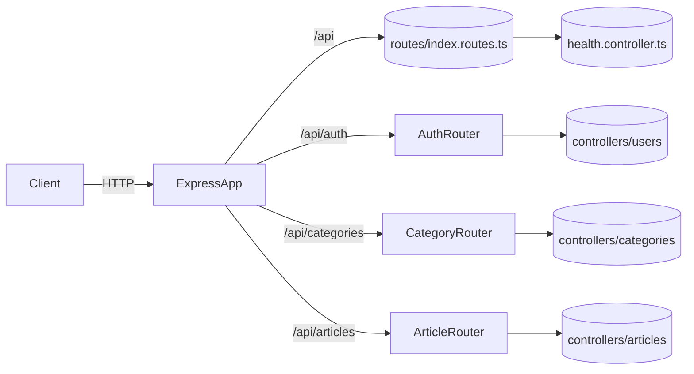

# Modern API — Project Handbook

_Last updated: 2025-11-26 (UTC)_

This guide captures the architecture, workflow, and responsibilities of each module so you can quickly reacclimate to the codebase.

---

## Tech Stack & Key Services
- **Runtime:** Node.js + Express 5 (TypeScript, CommonJS output).
- **Persistence:** MongoDB via Mongoose models (`User`, `Category`, `Article`, `RegistrationSettings`).
- **Security:** JWT auth (HTTP-only cookie), helmet, rate limiting, role guard.
- **Media:** Cloudinary (multer + `CloudinaryStorage`) for article images.
- **Observability:** morgan HTTP logging; console logging for critical flows.

---

## Runtime Workflow
1. `src/server.ts` loads environment variables, creates the HTTP server, and only then calls `connectDB()` and `initRegistrationSettings()` so MongoDB is ready and the singleton registration flag exists.
2. `src/app/app.ts` configures global middleware (helmet, JSON parser, CORS, logging, cookies) before mounting the route modules.
3. Requests pass through route-specific middleware stacks (rate limiting, auth, uploads). Controllers encapsulate domain logic and interact with the Mongoose models.
4. If unhandled errors bubble up they currently surface via controller `try/catch` blocks (a global error middleware exists but is not yet wired in).

> **Note:** `article.routes.ts` is mounted at `/api/articles`, so the POST endpoint becomes `/api/articles/articles` (router namespace + resource path).

---

## Directory Orientation

| Path | Purpose |
| --- | --- |
| `src/app/app.ts` | Express instance configuration, middleware wiring, and route mounting. |
| `src/server.ts` | Entry point; loads env vars, starts HTTP server, connects to MongoDB, seeds registration settings. |
| `src/app/routes/*.ts` | Route modules that bundle middleware stacks and map endpoints to controllers. |
| `src/app/controllers/**` | Request handlers grouped by domain (`users`, `categories`, `articles`, `health`). |
| `src/app/middlewares/**` | Custom middleware: auth, RBAC, rate limiting, upload, feature flags. |
| `src/app/models/**` | Mongoose schemas and helper logic (e.g., slug/excerpt generation for articles). |
| `src/app/config/**` | Integration configuration: MongoDB connection and Cloudinary credentials. |
| `src/utils/initRegistration.ts` | One-time initializer that ensures the singleton `RegistrationSettings` document exists. |

---

## Route & Controller Summary

| Route | Method | Controller | Description | Default Status Codes |
| --- | --- | --- | --- | --- |
| `/api/health` | GET | `healthCheck` | Service heartbeat, returns uptime info. | `200` |
| `/api/auth/login` | POST | `login` | Authenticates via email/password, issues JWT cookie. | `201`, `401`, `500` |
| `/api/auth/register` | POST | `register` | Creates a user if registration is allowed. | `201`, `400`, `409`, `503` |
| `/api/auth/me` | GET | `getMe` | Returns the authenticated user injected by `requireAuth`. | `200`, `401`, `404`, `500` |
| `/api/categories/create` | POST | `createCategory` | Public category creation with global rate limit. | `201`, `400`, `409`, `500` |
| `/api/categories/categories` | GET | `getAllCategories` | Lists all categories. | `200`, `500` |
| `/api/articles/articles` | POST | `createArticle` | Authenticated admin upload with Cloudinary + rate limiting. | `201`, `400`, `401`, `403`, `429`, `500` |
| `/api/articles/latest` | GET | `getLatestArticles` | Returns the 10 most recent published articles. | `200`, `500` |
| `/api/articles/featured` | GET | `getFeaturedArticles` | Returns up to 10 featured & published articles. | `200`, `500` |
| `/api/articles/published` | GET | `getPublishedArticles` | Returns all published articles (newest first). | `200`, `500` |
| `/api/articles/unpublished` | GET | `getUnpublishedArticles` | Admin-only listing of unpublished drafts. | `200`, `401`, `403`, `500` |

---

## Middleware Responsibilities

| File | Purpose | Key Responses / Notes |
| --- | --- | --- |
| `middlewares/rateLimiter.middleware.ts` | `authRateLimiter` protects login/register (10 requests/15 min); `globalRateLimiter` caps generic traffic (100/15 min); `doubleClickLimiter` enforces 1 request/5 s for article publishing. All emit `429` JSON errors via express-rate-limit. |
| `middlewares/registrationGuard.middleware.ts` | Checks `RegistrationSettings` to allow/deny new user registrations. Grants an override when credentials match `ADMIN_EMAIL` + `ADMIN_PASSWORD`. Responds `403` when closed or `503` if Mongo lookup fails. |
| `middlewares/requireAuth.middleware.ts` | Validates the `token` cookie, fetches the user by `_id`, ensures role/email match, and injects `req.user`. Responds `401` on missing/invalid tokens and `500` if `JWT_SECRET` is absent. |
| `middlewares/requireAdmin.middleware.ts` | Requires `req.user` with an `admin` role and (optionally) matching `ADMIN_EMAIL`. Returns `401` if unauthenticated and `403` if roles mismatch. |
| `middlewares/upload-cloudinary.middleware.ts` | Uses multer + CloudinaryStorage to accept `coverImage` (1) and up to 10 gallery `images`. Enforces a 10 MB limit per file; multer errors bubble up as `400` responses. |
| `middlewares/error.middleware.ts` | Placeholder for a global error handler; currently empty/not registered. |

---

## Controller Responsibilities

| Controller | Key Logic |
| --- | --- |
| `controllers/health.controller.ts` | Static JSON heartbeat with ISO timestamp. |
| `controllers/users/login.controller.ts` | Normalizes email, verifies password via `comparePassword`, signs a 7-day JWT, emits `token` cookie (env-dependent flags). |
| `controllers/users/signup.controller.ts` | Normalizes identity fields, checks duplicate emails, defers password hashing to the model, and surfaces mongoose validation/duplicate errors cleanly. |
| `controllers/users/getMe.controller.ts` | Returns `req.user` when set by `requireAuth`, otherwise `404`. |
| `controllers/categories/create.controller.ts` | Validates payload presence, lowercases names, enforces uniqueness, creates category. |
| `controllers/categories/getAllCategories.controller.ts` | Returns `{ categories }` from `Category.find()`. |
| `controllers/articles/createArticle.controller.ts` | Requires auth/admin stack, ingests multipart payload, maps Cloudinary URLs, normalizes tags/booleans, persists `Article` (slug/excerpt/reading time derived via schema hooks). |
| `controllers/articles/getLastTenArticles.controller.ts` | Fetches the latest 10 published articles with minimal author/category projections. |
| `controllers/articles/getFeaturedArticles.controller.ts` | Returns up to 10 featured & published articles, sorted newest-first. |
| `controllers/articles/getAllPublishedArticles.controller.ts` | Lists all published articles with featured flag, reading time, author/category info. |
| `controllers/articles/getUnpublishedArticles.controller.ts` | Returns unpublished drafts (admin sees all, fallback logic restricts to owner). |

---

## Models & Data Shape

| Model | Highlights |
| --- | --- |
| `models/user.model.ts` | Bcrypt pre-save hook, role enum (`user`/`admin`), optional avatar, `comparePassword` helper, password hidden by default (`select: false`). |
| `models/categories.model.ts` | `name` + optional `description`, both trimmed with timestamps and unique index on `name`. |
| `models/articles.model.ts` | Rich schema with helper functions (slugify, excerpt, reading time). Pre-save hooks enforce derived fields and slug uniqueness. |
| `models/permission.model.ts` (`RegistrationSettings`) | Singleton doc controlling `allowRegistration`; unique index prevents multiple records and stores `updatedBy`. |

---

## Configuration & Environment
- `.env` expectations:
  - `PORT`, `MONGO_URI`, `NODE_ENV`
  - `JWT_SECRET`
  - `ADMIN_EMAIL`, `ADMIN_PASSWORD`
  - `CLOUDINARY_CLOUD_NAME`, `CLOUDINARY_API_KEY`, `CLOUDINARY_API_SECRET`
- `config/db.ts` centralizes Mongo connection logic, logging disconnect/error events.
- `config/cloudinary.config.ts` wraps Cloudinary v2 client initialization used by the upload middleware.
- `utils/initRegistration.ts` seeds `RegistrationSettings` if missing (runs at startup).

---

## Operational Notes
- **Local dev:** `npm run dev` (ts-node-dev). Ensure MongoDB and env vars are loaded first.
- **Build:** `npm run build` generates `dist/`; `npm start` runs the compiled server.
- **First boot:** `initRegistrationSettings()` ensures a registration-settings document exists so registrations default to closed unless toggled.
- **Error handling:** Controllers currently handle their own `try/catch`. Wire up `error.middleware.ts` when you want centralized logging/response shaping.
- **Docs access:** `GET /project-docs` renders `docs/README.md`, `/project-docs/api` renders `docs/API.md`, and `/docs` serves Swagger UI.
- **Testing gap:** No automated tests are present; rely on REST client smoke tests until a test harness is added.

See `docs/API.md` for endpoint-level contracts.
